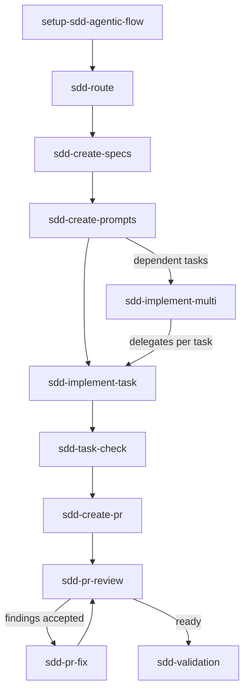

<p align="center">
  <picture>
    <source media="(prefers-color-scheme: dark)" srcset="public/imgs/tagline-dark.svg">
    <source media="(prefers-color-scheme: light)" srcset="public/imgs/tagline-light.svg">
    
  </picture>
</p>

**sdd-agentic-flow** is a local-first, zero-dependency Spec-Driven Development (SDD) toolkit designed for coding-agent workflows.

It empowers AI-assisted development through structured specs, clear boundaries, and human governance:

- **Capability-Contracted Skills:** Markdown skills built on condensed TLC (Type-Driven Development / Specification) and TDD baselines.
- **Adaptive Sizing:** Dynamic feature-profile sizing with optional auto-discovered project context.
- **Zero Footprint by Default:** Explicit, user-local skill installation. Project configuration (`.sdd/config.yml`) remains explicit and isolated to your project.
- **Human-in-the-Loop:** Built for continuous flow is designed to structure and guide AI workflows; it does not replace human code review and governance.

📖 Read the [Architecture Overview](docs/architecture.md) to see how the core components work together.

---
🇧🇷 *[Disponível também em português](README.pt-BR.md)*

## Quick start

```bash
npx sdd-agentic-flow init
npx sdd-agentic-flow install core
npx sdd-agentic-flow doctor
```

See [installation](docs/installation.md) for the full install guide, including pack selection
and re-running installation safely.

Use `init --interactive` to choose a project name, agent target, language, source type,
feature profile, and workflow defaults. Existing `.sdd/config.yml` files are preserved. `init`
also auto-discovers `.sdd/context/project-context.md`; re-run `discover [--force]` any time to
refresh it. See [configuration](docs/configuration.md).

Choose a language profile explicitly when creating a project:

```bash
npx sdd-agentic-flow init --language en-US
npx sdd-agentic-flow init --language pt-BR
```

See [language profiles](docs/language-profiles.md) for the profile contract.

## Why trust this toolkit?

- The source, CLI, docs, skills, and checks are open source and inspectable.
- The CLI is small, local-first, and has zero runtime dependencies.
- It has no telemetry, postinstall script, or outbound CLI network access by default.
- It does not automatically commit, push, merge, deploy, or publish.
- Installation is explicit; by default (`--scope user`) it writes only to per-agent global skill directories and creates zero files in your project. Configuration is explicit in `.sdd/config.yml`. See [installation scope](docs/installation-scope.md).
- `doctor` and `doctor --smoke` validate local setup, while publishable files are checked for blocked private-context markers.
- Licensing and TLC attribution are documented in [NOTICE](NOTICE) and [LICENSING.md](LICENSING.md).
- Human review remains the final authority.

See [the trust model](docs/trust-model.md) for scope and limits.

## Commands

```text
init [--interactive] [--language ...] [--feature-profile ...]  Create local configuration
discover [--force]                    Refresh auto-discovered project context
context [status|refresh]              Show or refresh project context provenance
install <pack> [--scope user|project] [--agent ...] [--plan]  Install a pack (default: user scope, zero project footprint)
doctor [--json] [--smoke] [--contracts]  Validate package or project setup
uninstall --plan                      Show only toolkit assets that would be removed
uninstall --apply [--include-config] [--scope user|project] [--agent ...]  Remove installed toolkit assets
list                                  List packs
```

`doctor --json` writes parseable JSON only. `doctor --smoke` validates init, install, preservation, and doctor in an isolated temporary directory. `install` defaults to `--scope user` (writes only to global per-agent skill directories, e.g. `~/.claude/skills`); pass `--scope project` to install into `.agents/skills/` inside the project instead, and `--agent codex|cursor|claude-code|vscode-copilot` to restrict which global directories are written. See [installation scope](docs/installation-scope.md). If `doctor` reports a `WARN`/`FAIL` you don't understand, see [troubleshooting](docs/troubleshooting.md).

## Packs

| Pack             | Purpose                                                                       |
| ---------------- | ----------------------------------------------------------------------------- |
| `core`           | Safe setup, specification, implementation, checking, and validation baseline. |
| `planning`       | Specs and task prompts.                                                       |
| `execution`      | Single-task and multi-task execution guidance.                                |
| `pr`             | PR preparation, review, and finding repair.                                   |
| `multi-worktree` | Multi-task orchestration guidance.                                            |
| `full`           | All public skills.                                                            |

`local-files` and `github` compose packs for those source contexts.

## Execution modes

The toolkit documents five local operating modes: `plan`, `guided`, `apply`, `review`, and `full`. `full` means a coordinated local workflow, not unrestricted autonomy. See [execution modes](docs/execution-modes.md).

## Main SDD flow

Plan → Prompt → Implement → Check → PR → Review → Fix → Validate



Use `sdd-route` when the next step is unclear. It only recommends a route and points to the selected skill's `SKILL.md`; it does not invoke skills or change files. See [the invocation model](docs/invocation-model.md), [why this exists](docs/why-this-exists.md),
and [design principles](docs/design-principles.md).

## TDD baseline

`sdd-agentic-flow` uses a TLC baseline for planning and specifications and a TDD
baseline for implementation. The TDD baseline uses behavior-focused tests at
agreed public seams through RED → GREEN → REFACTOR loops and vertical slices.
See [TDD baseline](docs/tdd-baseline.md) and [TLC integration](docs/tlc-integration.md)
for what this package ships versus the external skills it adapts from.

## Uninstall and rollback

```bash
npx sdd-agentic-flow uninstall --plan
npx sdd-agentic-flow uninstall --apply
```

Uninstall removes only known installed toolkit skill directories, from both scopes by default. It preserves specs, reports, snapshots, source code, and unknown paths. Add `--include-config` only when you also want to remove `.sdd/config.yml`, or `--scope`/`--agent` to target one installation. See [uninstall](docs/uninstall.md) and [upgrading](docs/upgrading.md) for what's safe to re-run after updating the CLI.

## Who is this for?

This toolkit is optimized for teams adopting Spec Driven Development; sprint feature delivery in agile, scrum, or kanban workflows; tech leads breaking work into specs, tasks, prompts, reviews, and validation; developers delegating traceable work to coding agents; TDD/test-first teams; and controlled multi-agent or multi-worktree work.

## Not optimized for

It is not optimized for quick one-off scripts, fully autonomous no-review agents, automatic deploy/release pipelines, or workflows that do not want specs, task boundaries, review gates, and validation checkpoints.

## Skill map

For the long-form version of this table — Purpose, When to use/not to use, Inputs/Outputs,
Dependencies, Conflicts, Baseline, Pack(s), and flow position for each skill — see the
[skills catalog](docs/skills-catalog.md).

| Skill                    | Purpose                     | Input             | Output                 | Mutates files?       | Default mode | Recommended when            |
| ------------------------ | --------------------------- | ----------------- | ---------------------- | -------------------- | ------------ | --------------------------- |
| `setup-sdd-agentic-flow` | Setup project configuration | Project context   | Local setup guidance   | Yes, when authorized | guided       | Starting a project          |
| `sdd-route`              | Recommend next local skill  | Request/artifacts | Route recommendation   | No                   | plan         | The next step is unclear    |
| `sdd-create-specs`       | Plan feature specs          | Source item OR existing codebase | Feature spec set       | Yes, when authorized | plan         | Requirements need structure, or undocumented code needs specs |
| `sdd-create-prompts`     | Generate task prompts       | Specs/tasks       | Agent-ready prompts    | Yes, when authorized | plan         | Work must be delegated      |
| `sdd-implement-task`     | Implement one task          | Approved task     | Code and evidence      | Yes, when authorized | apply        | One bounded task is ready   |
| `sdd-implement-multi`    | Plan multi-task execution   | Task set          | Execution plan         | Yes, when authorized | guided       | Tasks have dependencies     |
| `sdd-task-check`         | Independent task check      | Task evidence     | Check report           | No                   | review       | Before accepting a task     |
| `sdd-create-pr`          | Prepare PR                  | Completed change  | PR package             | Yes, when authorized | guided       | Review package is needed    |
| `sdd-pr-review`          | Review PR                   | PR/change set     | Findings               | No                   | review       | Reviewing a change          |
| `sdd-pr-fix`             | Fix PR findings             | Findings          | Corrected local change | Yes, when authorized | apply        | Findings are accepted       |
| `sdd-validation`         | Validate feature            | Feature evidence  | Validation report      | No                   | review       | Before completion           |

## Agent workflows

Read the [skills usage guide](docs/sdd-skills-usage-guide.md), [Codex CLI](docs/using-with-codex.md), [Cursor](docs/using-with-cursor.md), [Claude Code](docs/using-with-claude-code.md), [VS Code + GitHub Copilot](docs/using-with-vscode-copilot.md), and [prompt recipes](docs/prompt-recipes.md). For an optional AI development harness, see [recommended harness](docs/recommended-harness.md).

The skills are Markdown-first and installed locally. See [agent compatibility](docs/agent-compatibility.md) for validated workflows and limits.

## Domain vocabulary

Language profiles select human-facing output language; a domain glossary records product terms. The glossary is optional, never created by `init`, and may be proposed or written only with explicit authorization. See [domain vocabulary](docs/domain-vocabulary.md).

## Examples, language, and inspiration

The complete generic [task-management golden example](examples/golden/task-management/) shows a source item through validation. The primary README is English; read the practical [Portuguese introduction](README.pt-BR.md) and [language policy](docs/i18n.md) for the bilingual policy.

### Golden flows

5 flows are proved as integration tests in `test/cli.test.js`, not just documentation — each
has a `walkthrough.md` describing the commands the test runs and the result it checks:
[greenfield](examples/golden/task-management/walkthrough.md),
[existing-code mode](examples/golden/existing-code-mode/walkthrough.md),
[project-context lifecycle](examples/golden/project-context-lifecycle/walkthrough.md),
[PR (create → review → fix → review)](examples/golden/pr-flow/walkthrough.md), and
[version migration (v0.8.0 → v0.9.0)](examples/golden/version-migration/walkthrough.md).

The toolkit adapts TLC and TDD baselines and combines Spec Driven Development,
Markdown-first skills, and local safety practices. See [inspirations](docs/inspirations.md),
[NOTICE](NOTICE), [LICENSING.md](LICENSING.md), the [compatibility promise](docs/compatibility-promise.md),
the [compatibility matrix](docs/compatibility-matrix.md),
and the [Portuguese skills guide](docs/sdd-skills-usage-guide.pt-BR.md).

For decision help, see the guides on
[choosing a feature profile](docs/guides/choosing-a-feature-profile.md),
[adopting in a brownfield repo](docs/guides/adopting-in-a-brownfield-repo.md), and
[condensed vs. full TLC/TDD](docs/guides/condensed-vs-full-tlc-tdd.md).

## Safety boundaries

The CLI does not call external APIs, require a tracker, sync remotely, update itself, or perform Git/release operations. It is not a compliance, security, or production-readiness guarantee. Review outputs and local changes before accepting them.

## Publishing

Review locally, then follow [docs/publishing.md](docs/publishing.md). The package never publishes itself.
