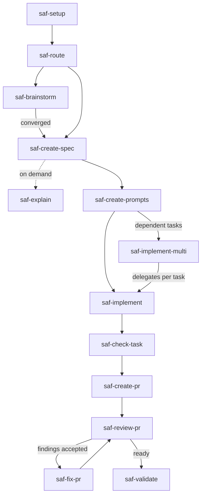

<p align="center">
  <picture>
    <source media="(prefers-color-scheme: dark)" srcset="public/imgs/tagline-dark.svg">
    <source media="(prefers-color-scheme: light)" srcset="public/imgs/tagline-light.svg">
    
  </picture>
</p>

**sdd-agentic-flow** is a local-first, zero-dependency Spec-Driven Development (SDD) toolkit for coding-agent workflows.

Your agent can ship a diff in minutes—and still leave you guessing whether it matched the intent. This toolkit closes that gap: **spec first, evidence before done, you approve the merge.**

## What is sdd-agentic-flow?

**sdd-agentic-flow is a local-first agentic software-engineering harness that turns specification-driven development into a structured, verifiable workflow for coding agents.**

It is not just a collection of Agent Skills. Skills are the **execution layer**. Around them sit the methodology, artifact contracts, condensed TLC and TDD baselines, evidence model, configuration, CLI, and lifecycle.

The goal is not agent autonomy. The goal is structured, traceable, verifiable agent-assisted engineering, with humans as the gate.

*The agent does the work. The specification defines what should be true. Sensors provide evidence. The human remains the gate.*

Sources that inform this design — tagged by epistemic role, not as specifications — are listed in [inspirations](docs/inspirations.md).

Structured specs, clear boundaries, and human governance:

- **Execution layer:** capability-contracted Markdown skills on condensed TLC and TDD baselines.
- **Adaptive sizing:** Feature-profile sizing with optional auto-discovered project context.
- **Zero footprint by default:** User-local skill install; `.sdd-agentic-flow/config.yml` only when you create it.
- **Human-in-the-loop:** The toolkit structures agent work; you keep final review authority.
- **Language-agnostic:** The CLI runs on Node.js >= 22; your project does not have to.

For AI-first and AI-driven teams, that split is the point: humans architect and verify; agents execute under this harness. Craftsmanship still matters — agents fail on code humans cannot read. This README does not quote token or speed multipliers.

📦 Install and run with `npx sdd-agentic-flow` — [get started](#get-started) · 📖 [Skills usage guide](docs/sdd-skills-usage-guide.md) · 🏗 [Architecture](docs/architecture.md)

---
🇧🇷 *[Disponível também em português](README.pt-BR.md)*

## The problem

You delegate a task. The agent jumps to code, blurs boundaries, and marks work done without executable proof. Review time goes to reconstructing intent from the diff—not validating behavior.

| Common failure | Local response |
| --- | --- |
| Implementation starts before requirements are understood | `saf-create-spec` and `saf-create-prompts` |
| A task is too large for one controlled change | `saf-implement` or `saf-implement-multi` |
| Output is accepted without evidence | `saf-check-task` and `saf-validate` |
| A PR loses traceability to the feature | `saf-create-pr`, `saf-review-pr`, and `saf-fix-pr` |

See [why this exists](docs/why-this-exists.md) for the short form. For the four-layer mental model (Prompt → Context → Harness → Loop + SDD), see [sdd-agentic-flow model](docs/sdd-agentic-flow-model.md).

## Beyond prompts

Most agent tooling stops at better prompts. **sdd-agentic-flow** adds the layers prompts alone cannot hold:

| Layer | One-line role |
| --- | --- |
| Prompt | Task instructions per skill |
| Context | Specs + project context + config |
| Harness | Modes, contracts, safety, evidence rules |
| Loop | Autonomy, guardrails, loop-state, resume |

**SDD** defines done before implementation starts. The CLI installs and validates; your agent executes. Read the [mental model doc](docs/sdd-agentic-flow-model.md) for the full map.

## The solution

Write the spec first. The spec is the contract between you and the agent: behavior, scope, and acceptance criteria live in `.specs/features/` before anyone edits production code.

You stay the decision-maker; the toolkit holds the gates. It gives you a linear workflow with review checkpoints—not an open-ended chat loop. Each phase has a Markdown skill, local safety defaults, and evidence artifacts you can inspect. Read [SDD methodology](docs/sdd-methodology.md) for the full picture.

## What changes for you

| Outcome | How this toolkit delivers it |
| --- | --- |
| Task boundaries | Specs, task prompts, and `saf-check-task` per slice |
| Traceability | Spec → prompt → code → PR package in one chain |
| Evidence before done | TDD baseline, check reports, validation reports |
| Clearer agent input | Written specs and `.sdd-agentic-flow/config.yml` replace repeated chat context |
| Async teamwork | Versioned artifacts in `.specs/` and `.sdd-agentic-flow/` |
| Reversible setup | `uninstall --plan`, explicit install scope, [trust model](docs/trust-model.md) |

> [!NOTE]
> Token economics benchmark: planned for a future release ([ROADMAP.md](ROADMAP.md)). This README does not quote token or speed multipliers without measured data.

## Get started

Requires Node.js >= 22 for the CLI only. Your project does not need Node.js. See [environment compatibility](docs/environment-compatibility.md).

```bash
npx sdd-agentic-flow init --preset manual
npx sdd-agentic-flow install core
npx sdd-agentic-flow doctor
```

That creates `.sdd-agentic-flow/config.yml`, installs skills, and validates setup. The CLI is a **control plane** for setup, inspect, guide, and maintain — it does not invoke skills. See [What is SDD?](docs/what-is-sdd.md) and the [commands reference](docs/commands.md).

`init --preset` writes the two existing fields (`execution_mode`, `autonomy_level`) — it is not a third config axis.

| Preset | Writes | How the path runs |
| --- | --- | --- |
| `manual` (default; alias `man`) | `guided` + `manual` | Stop after each skill |
| `supervised` (aliases `assist`, `assisted`) | `apply` + `supervised` | Propose next skill; you confirm |
| `autonomous` (alias `auto`) | `full` + `autonomous` | Same session may follow the next on-path `SKILL.md` while all 7 guardrails pass |

Do not mix `--preset` with `--execution-mode` / `--autonomy-level`. Power users can still set those two flags without `--preset`. See [configuration](docs/configuration.md).

**Autonomous does not mean unattended.** Commit, push, merge, tag, and publish stay human on every preset. The CLI does not run skills.

Next: invoke `saf-route` or open the [skills usage guide](docs/sdd-skills-usage-guide.md). Copy a prompt from [prompt recipes](docs/prompt-recipes.md) when you delegate to an agent.

Start with `npx sdd-agentic-flow init`. In a real terminal it offers a recommended setup or
customization, then configures, installs the `full` pack by default, prepares context, and
validates the result. Scripts and CI stay deterministic with `init --non-interactive`. See
[getting started](docs/getting-started.md).

## How it works

**Canonical workflow path:** Plan → Prompt → Implement → Check → PR → Review → Fix → Validate



Invoke `saf-route` when the next step is unclear. It recommends a skill and points to that skill's `SKILL.md`; it does not invoke skills or change files.

## Proved in this repository

These walkthroughs are not slide-deck claims—they run as integration tests in `test/cli.test.ts`. Each one lists the commands the test runs and what it checks.

| Flow | What it proves | Walkthrough |
| --- | --- | --- |
| Greenfield feature | Source item through validation | [task-management](examples/golden/task-management/walkthrough.md) |
| Existing code | Specs from undocumented code | [existing-code mode](examples/golden/existing-code-mode/walkthrough.md) |
| Project context | `discover` / `context` lifecycle | [project-context lifecycle](examples/golden/project-context-lifecycle/walkthrough.md) |
| PR loop | Create → review → fix → review | [pr-flow](examples/golden/pr-flow/walkthrough.md) |
| Autonomy AUTO-001 | Idea → spec under autonomous config | [autonomy-idea-to-spec](examples/golden/autonomy-idea-to-spec/walkthrough.md) |
| Autonomy AUTO-002 | Spec → validate chain | [autonomy-spec-to-validate](examples/golden/autonomy-spec-to-validate/walkthrough.md) |
| Autonomy AUTO-003 | Guardrail pause → resume | [autonomy-guardrail-pause-resume](examples/golden/autonomy-guardrail-pause-resume/walkthrough.md) |
| Autonomy AUTO-004 | Human override (guardrail 3) | [autonomy-human-override](examples/golden/autonomy-human-override/walkthrough.md) |
| Autonomy AUTO-005 | Budget exhaustion (guardrail 6) | [autonomy-budget-exhaustion](examples/golden/autonomy-budget-exhaustion/walkthrough.md) |

The generic [task-management example](examples/golden/task-management/) shows one feature end to end. Autonomy flows prove static CLI contracts for bounded auto-advance—not live LLM orchestration.

## Learn more

| Topic | Doc |
| --- | --- |
| Mental model (4 layers + SDD) | [docs/sdd-agentic-flow-model.md](docs/sdd-agentic-flow-model.md) |
| SDD methodology | [docs/sdd-methodology.md](docs/sdd-methodology.md) |
| Architecture | [docs/architecture.md](docs/architecture.md) |
| All 13 skills | [docs/skills-catalog.md](docs/skills-catalog.md) |
| Agent setup | [Codex](docs/using-with-codex.md), [Cursor](docs/using-with-cursor.md), [Claude Code](docs/using-with-claude-code.md), [VS Code + Copilot](docs/using-with-vscode-copilot.md) |
| Language policy | [docs/i18n.md](docs/i18n.md) · [README em português](README.pt-BR.md) |
| Contribute | [CONTRIBUTING.md](CONTRIBUTING.md) |

## Who is this for?

You are a good fit if you adopt Spec-Driven Development, run sprint delivery with review gates, split work into specs and tasks as a tech lead, delegate traceable slices to agents, practice TDD-first delivery, or coordinate multi-agent or multi-worktree work under human control.

## Not optimized for

Quick one-off scripts, fully autonomous no-review agents, automatic deploy/release pipelines, or workflows that reject specs, task boundaries, and validation checkpoints.

<details>
<summary><strong>Technical reference</strong> (CLI, packs, skill map, trust, safety)</summary>

## Why trust this toolkit?

- The source, CLI, docs, skills, and checks are open source and inspectable.
- The CLI is small, local-first, and has zero runtime dependencies.
- It has no telemetry, postinstall script, or outbound CLI network access by default. Network
  access is limited to three explicit entry points: `doctor --check-updates`, `upgrade` (and
  `--check`/`--plan`), and an interactive bare-welcome ask (human-rich TTY, default N). See
  [the trust model](docs/trust-model.md).
- It does not automatically commit, push, merge, deploy, or publish.
- Installation is explicit; by default (`--scope user`) it writes only to per-agent global skill directories and creates zero files in your project. Configuration is explicit in `.sdd-agentic-flow/config.yml`. See [installation scope](docs/installation-scope.md).
- `doctor` and `doctor --smoke` validate local setup, while publishable files are checked for blocked private-context markers.
- Licensing and TLC attribution are documented in [NOTICE](NOTICE) and [LICENSING.md](LICENSING.md).
- Human review remains the final authority.

See [the trust model](docs/trust-model.md) for scope and limits.

## Commands

```text
init [--interactive|--non-interactive] [--language ...|--en|--br] [--feature-profile ...] [--execution-mode ...] [--autonomy-level ...] [--quiet]  Guided setup or local configuration
configure [--scope user|project] [--pack ...] [--target ...] [--plan]  Save installation intent
discover [--force] [--quiet]          Refresh auto-discovered project context
context [status|refresh|autonomy-state]  Show or refresh project context provenance, or autonomy loop state
install <pack> [--scope user|project] [--agent ...] [--plan] [--quiet]  Install a pack (default: user scope, zero project footprint)
doctor [--json] [--smoke] [--contracts] [--autonomy] [--verbose] [--check-updates]  Validate package or project setup
upgrade [--check|--plan|--skills-only] Check for / apply CLI and skills updates (confirm-gated)
autonomous-resume [--force] [--override-guard=N --reason=...]  Resume an autonomous workflow paused at a guardrail
uninstall --plan                      Show only toolkit assets that would be removed
uninstall --apply [--include-config] [--full] [--scope user|project] [--agent ...] [--verbose] [--quiet]  Remove installed toolkit assets
list                                  List packs
help [command]                        Show the command reference, or one command's usage
```

`doctor --json` writes parseable JSON only. `doctor --smoke` validates init, install, preservation, and doctor in an isolated temporary directory. `doctor --check-updates` is a diagnostic update check; `upgrade --check` is the upgrade-specific read-only check; `upgrade` confirms before mutating. See [the trust model](docs/trust-model.md) and [v2 breaking changes](docs/v2-breaking-changes.md).

`install` defaults to `--scope user` (writes only to global per-agent skill directories, e.g. `~/.claude/skills`). Pass `--scope project` to install into `.agents/skills/` inside the project instead. Pass `--agent codex|cursor|claude-code|vscode-copilot` to restrict which global directories are written. See [installation scope](docs/installation-scope.md).

If `doctor` reports a `WARN`/`FAIL` you do not understand, see [troubleshooting](docs/troubleshooting.md). Every command also accepts `--help` (equivalent to `help <command>`) for its full usage and examples. Add `--quiet` to `init`/`install`/`uninstall`/`discover` to suppress decorative success output.

Running `npx sdd-agentic-flow` with no command shows a contextual status screen (what's already set up, and one suggested next command) instead of the full reference. It never runs anything on its own. At a genuinely interactive terminal (a real TTY, and no `CI` env var set), it also offers a numbered menu below the status screen; selecting an entry runs the exact same command the equivalent typed invocation would, and the uninstall entry only ever previews (`--plan`), never applies. Piped output, scripts, CI, and agent invocations always see just the status screen, unchanged. Run `npx sdd-agentic-flow help` for the full command reference, or `help <command>` / `<command> --help` for one command's usage and examples.

Unknown commands, packs, and agent names get a "Did you mean `<closest match>`?" suggestion under a structured `Try:` block. Colored status output (`PASS`/`WARN`/`FAIL`/...) appears automatically on a real terminal; set `NO_COLOR=1` to force plain text, or pipe/redirect output, which disables color automatically. A pipe or CI run remains deterministic human-readable text; `doctor --json` is the explicit machine contract. `FORCE_COLOR` is honored only on a real TTY; `--ascii` / `SDD_ASCII=1` forces ASCII symbols. Exit codes: `0` success, `1` a handled/validation failure, `2` an unexpected/internal error. See [CLI interaction](docs/cli-interaction.md).

Choose a language profile explicitly when creating a project:

```bash
npx sdd-agentic-flow init --language en-US
npx sdd-agentic-flow init --language pt-BR
# --en / --br are shorthand for the two flags above
npx sdd-agentic-flow init --en
npx sdd-agentic-flow init --br
```

See [language profiles](docs/language-profiles.md) for the profile contract.

## Packs

| Pack | Purpose |
| --- | --- |
| `core` | Safe setup, specification, implementation, checking, and validation baseline. |
| `planning` | Specs and task prompts. |
| `execution` | Single-task and multi-task execution guidance. |
| `pr` | PR preparation, review, and finding repair. |
| `multi-worktree` | Multi-task orchestration guidance. |
| `full` | All public skills. |

`local-files` and `github` compose packs for those source contexts.

## Execution modes

The toolkit documents five local operating modes: `plan`, `guided`, `apply`, `review`, and `full`. `full` means a coordinated local workflow, not unrestricted autonomy. See [execution modes](docs/execution-modes.md).

## Autonomy levels

`workflow.autonomy_level` (`manual`/`supervised`/`autonomous`, default `manual`) is a second, orthogonal axis: `execution_mode` says what a skill may do, `autonomy_level` says whether it needs a human before the next one runs. `autonomous` only advances when all 7 deterministic guardrails pass (completion, evidence, verification, scope, transition validity, resource budget, no human override); any failure hands control back to a human. Set it with `init --autonomy-level`, audit it with `doctor --autonomy`, and inspect an in-flight run with `context autonomy-state` / `autonomous-resume`. See [autonomy levels](docs/autonomy-levels.md) and [autonomy guardrails](docs/autonomy-guardrails.md).

## TDD baseline

`sdd-agentic-flow` uses a TLC baseline for planning and specifications and a TDD baseline for implementation. The TDD baseline requires adequate behavioral sensors at a contractual seam and recorded current evidence. Test-first is recommended when it sharpens the spec. Full RED → GREEN → REFACTOR is optional and is never treated as harness proof. A passing sensor is evidence, not a correctness verdict. Self-report is not evidence. Specs are living control artifacts; rigor follows uncertainty and risk, not only diff size. See [TDD baseline](docs/tdd-baseline.md) and [baselines](docs/baselines.md) for what this package ships versus the external skills it adapts from.

## Uninstall and rollback

```bash
npx sdd-agentic-flow uninstall --plan
npx sdd-agentic-flow uninstall --apply
```

Uninstall removes only known installed toolkit skill directories, from both scopes by default. It preserves specs, reports, snapshots, source code, and unknown paths. Add `--include-config` only when you also want to remove `.sdd-agentic-flow/config.yml`, or `--scope`/`--agent` to target one installation. For a full reset before a clean reinstall, use `uninstall --apply --full`. It also removes `.sdd-agentic-flow/context/project-context.md`, `.sdd-agentic-flow/snapshots`, and `.sdd-agentic-flow/reports` (all regenerable); `.specs/features` is never removed by any flag. Add `--quiet` to suppress the trailing "preserves ..." explanatory line. See [uninstall](docs/uninstall.md) and [v2 breaking changes](docs/v2-breaking-changes.md) for what's safe to re-run after updating the CLI.

## Skill map

For the long-form version of this table, see the [skills catalog](docs/skills-catalog.md).

| Skill | Purpose | Input | Output | Mutates files? | Default mode | Recommended when |
| --- | --- | --- | --- | --- | --- | --- |
| `saf-setup` | Setup project configuration | Project context | Local setup guidance | Yes, when authorized | guided | Starting a project |
| `saf-route` | Recommend next local skill | Request/artifacts | Route recommendation | No | plan | The next step is unclear |
| `saf-brainstorm` | Shape a vague idea | Rough idea | Spec-ready brief | Yes, when converged | guided | The idea isn't spec-ready yet |
| `saf-create-spec` | Plan feature specs | Source item OR existing codebase | Feature spec set | Yes, when authorized | plan | Requirements need structure, or undocumented code needs specs |
| `saf-explain` | Explain a specified feature | Spec package | Plain-language explanation | Yes, when authorized | guided | Someone needs context without reading every artifact |
| `saf-create-prompts` | Generate task prompts | Specs/tasks | Agent-ready prompts | Yes, when authorized | plan | Work must be delegated |
| `saf-implement` | Implement one task | Approved task | Code and evidence | Yes, when authorized | apply | One bounded task is ready |
| `saf-implement-multi` | Plan multi-task execution | Task set | Execution plan | Yes, when authorized | guided | Tasks have dependencies |
| `saf-check-task` | Independent task check | Task evidence | Check report | No | review | Before accepting a task |
| `saf-create-pr` | Prepare PR | Completed change | PR package | Yes, when authorized | guided | Review package is needed |
| `saf-review-pr` | Review PR | PR/change set | Findings | No | review | Reviewing a change |
| `saf-fix-pr` | Fix PR findings | Findings | Corrected local change | Yes, when authorized | apply | Findings are accepted |
| `saf-validate` | Validate feature | Feature evidence | Validation report | No | review | Before completion |

## Agent workflows

Read the [skills usage guide](docs/sdd-skills-usage-guide.md), [Codex CLI](docs/using-with-codex.md), [Cursor](docs/using-with-cursor.md), [Claude Code](docs/using-with-claude-code.md), [VS Code + GitHub Copilot](docs/using-with-vscode-copilot.md), and [prompt recipes](docs/prompt-recipes.md). For an optional AI development harness, see [recommended harness](docs/recommended-harness.md).

The skills are Markdown-first and installed locally. See [agent compatibility](docs/agent-compatibility.md) for validated workflows and limits.

## Domain vocabulary

Language profiles select human-facing output language; a domain glossary records product terms. The glossary is optional, never created by `init`, and may be proposed or written only with explicit authorization. See [domain vocabulary](docs/domain-vocabulary.md).

## Inspiration and guides

The toolkit adapts TLC and TDD baselines and combines Spec-Driven Development, Markdown-first skills, and local safety practices. Those inspirations now include epistemic roles; project contracts remain authoritative. See [inspirations](docs/inspirations.md), [NOTICE](NOTICE), [LICENSING.md](LICENSING.md), the [compatibility promise](docs/compatibility-promise.md), the [compatibility matrix](docs/compatibility-matrix.md), and the [Portuguese skills guide](docs/sdd-skills-usage-guide.pt-BR.md).

For decision help, see [choosing a feature profile](docs/guides/choosing-a-feature-profile.md), [adopting in a brownfield repo](docs/guides/adopting-in-a-brownfield-repo.md), and [condensed vs. full TLC/TDD](docs/guides/condensed-vs-full-tlc-tdd.md).

## Safety boundaries

The CLI does not call external APIs, require a tracker, sync remotely, or perform Git/release operations by default. Opt-in update paths (`doctor --check-updates`, `upgrade`, welcome ask) never mutate without confirmation; `upgrade` may run `npm install -g` or refresh skills only after you say yes. This toolkit is not a compliance, security, or production-readiness guarantee. Review outputs and local changes before accepting them. See [safety model](docs/safety-model.md).

## Publishing

Maintainers: see [publishing](docs/publishing.md).

</details>
