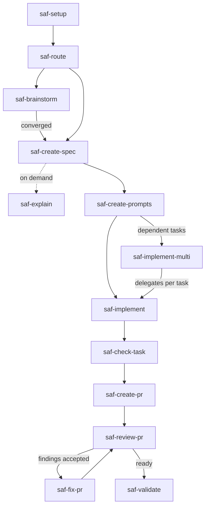

# sdd-agentic-flow

Versão prática em português. Leia o [README principal em inglês](README.md) para a referência técnica completa.

**sdd-agentic-flow** é um toolkit local-first e zero-dependência de Spec-Driven Development (SDD) para fluxos com agentes de código.

Seu agente pode entregar um diff em minutos — e ainda deixar dúvida se cumpriu a intenção. Este toolkit fecha esse gap: **spec primeiro, evidência antes de concluir, você aprova o merge.**

## O que é o sdd-agentic-flow?

**O sdd-agentic-flow é um harness local-first de engenharia de software assistida por agentes que transforma desenvolvimento orientado a especificações em um workflow estruturado e verificável para coding agents.**

Não é só um pacote de Agent Skills. As skills são a **camada de execução** (*execution layer*). Em volta delas: metodologia, contratos de artefato, baselines, modelo de evidência, configuração, CLI e lifecycle.

O objetivo não é autonomia do agente. O objetivo é engenharia assistida por agentes, estruturada, rastreável e verificável, com humanos como o gate.

*O agente faz o trabalho. A especificação define o que deve ser verdadeiro. Sensores fornecem evidência. O humano permanece o gate.*

Fontes que informam este desenho — com papéis epistêmicos, não como specs — estão em [inspirations](docs/inspirations.md).

Specs estruturadas, limites claros e governança humana:

- **Camada de execução:** skills Markdown com contrato de capacidade sobre baselines TLC e TDD condensados.
- **Dimensionamento adaptativo:** perfis de feature com contexto de projeto auto-descoberto opcional.
- **Zero footprint por padrão:** instalação user-local; `.sdd-agentic-flow/config.yml` só quando você cria.
- **Humano no loop:** o toolkit estrutura o trabalho do agente; você mantém a autoridade final de revisão.
- **Agnóstico de linguagem:** a CLI roda em Node.js >= 22; seu projeto não precisa ser Node.

Para times AI-first e AI-driven, essa divisão é o ponto: humanos arquitetam e verificam; agentes executam sob este harness. Craftsmanship continua importando — agentes falham em código que humanos não conseguem ler. Este README não cita multiplicadores de token ou velocidade.

📦 Instale e rode com `npx sdd-agentic-flow` — [início rápido](#início-rápido) · 📖 [Guia de uso das skills](docs/sdd-skills-usage-guide.pt-BR.md) · 🏗 [Arquitetura](docs/architecture.md)

## O problema

Você delega uma tarefa. O agente pula para o código, mistura limites e marca trabalho como concluído sem prova executável. O tempo de revisão vai reconstruir a intenção a partir do diff — não validar o comportamento.

| Falha comum | Resposta local |
| --- | --- |
| Implementação começa antes de entender os requisitos | `saf-create-spec` e `saf-create-prompts` |
| A tarefa é grande demais para uma mudança controlada | `saf-implement` ou `saf-implement-multi` |
| Saída aceita sem evidência | `saf-check-task` e `saf-validate` |
| PR perde rastreabilidade com a feature | `saf-create-pr`, `saf-review-pr` e `saf-fix-pr` |

Veja [por que o toolkit existe](docs/why-this-exists.md). Para o modelo mental das quatro camadas (Prompt → Context → Harness → Loop + SDD), leia [sdd-agentic-flow model](docs/sdd-agentic-flow-model.md).

## Além dos prompts

A maioria das ferramentas para agentes para em prompts melhores. O **sdd-agentic-flow** adiciona camadas que prompt sozinho não sustenta:

| Camada | Papel em uma linha |
| --- | --- |
| Prompt | Instruções por skill |
| Context | Specs + contexto de projeto + config |
| Harness | Modos, contratos, safety, evidência |
| Loop | Autonomia, guardrails, loop-state, resume |

**SDD** define o que é “pronto” antes da implementação. A CLI instala e valida; seu agente executa. Veja o [doc de modelo mental](docs/sdd-agentic-flow-model.md).

## A solução

Escreva a spec primeiro. A spec é o contrato entre você e o agente: comportamento, escopo e critérios de aceite ficam em `.specs/features/` antes de alterar código de produção.

Você continua no comando; o toolkit segura os gates. Ele oferece um fluxo linear com checkpoints de revisão — não um chat aberto. Cada fase tem uma skill Markdown, defaults de segurança locais e artefatos de evidência que você inspeciona. Leia a [metodologia SDD](docs/sdd-methodology.md) (em inglês) para o panorama completo.

## O que muda para você

| Resultado | Como o toolkit entrega |
| --- | --- |
| Limites de tarefa | Specs, prompts de tarefa e `saf-check-task` por fatia |
| Rastreabilidade | Spec → prompt → código → pacote de PR em uma cadeia |
| Evidência antes de concluir | TDD baseline, check reports, validation reports |
| Entrada mais clara para o agente | Specs escritas e `.sdd-agentic-flow/config.yml` em vez de repetir contexto no chat |
| Trabalho assíncrono | Artefatos versionados em `.specs/` e `.sdd-agentic-flow/` |
| Setup reversível | `uninstall --plan`, escopo de instalação explícito, [modelo de confiança](docs/trust-model.md) |

> [!NOTE]
> Benchmark de token economics: planejado para release futura ([ROADMAP.md](ROADMAP.md)). Este README não cita multiplicadores de token ou velocidade sem dados medidos.

## Início rápido

Requer Node.js >= 22 só para a CLI. Seu projeto não precisa ser Node.js. Veja [compatibilidade de ambiente](docs/environment-compatibility.md).

```bash
npx sdd-agentic-flow init
npx sdd-agentic-flow install core
npx sdd-agentic-flow doctor
```

Isso cria `.sdd-agentic-flow/config.yml`, instala skills e valida o setup. A CLI é um **plano de controle** para setup, inspeção e manutenção — não invoca skills. Veja [O que é SDD?](docs/what-is-sdd.md) e a [referência de comandos](docs/commands.md).

`init --preset` grava os dois campos existentes (`execution_mode`, `autonomy_level`) — não é um terceiro eixo de config.

| Preset | Grava | Como o caminho corre |
| --- | --- | --- |
| `manual` (padrão; alias `man`) | `guided` + `manual` | Para depois de cada skill |
| `supervised` (aliases `assist`, `assisted`) | `apply` + `supervised` | Propõe a próxima skill; você confirma |
| `autonomous` (alias `auto`) | `full` + `autonomous` | A mesma sessão pode seguir o próximo `SKILL.md` no caminho enquanto os 7 guardrails passam |

Não misture `--preset` com `--execution-mode` / `--autonomy-level`. **Autonomous does not mean unattended.** Commit, push, merge, tag e publish continuam humanos em todo preset. A CLI não executa skills.

Depois: invoque `saf-route` ou abra o [guia de uso das skills](docs/sdd-skills-usage-guide.pt-BR.md). Copie um prompt de [prompt recipes](docs/prompt-recipes.md) (em inglês) ao delegar a um agente.

Em um terminal real, `init` guia a configuração, instala o pack `full`, prepara o
contexto e valida o resultado. Use `init --non-interactive` em scripts e CI. Veja
[início rápido](docs/getting-started.md).

Ao escolher `pt-BR`, a saída humana da CLI — prompts, planos, doctor, menu e `learn-sdd` —
passa a usar português brasileiro. Commands, paths, statuses, IDs e JSON permanecem em inglês
canônico para continuar copiáveis e estáveis.

## Como funciona

**Canonical workflow path:** Plan → Prompt → Implement → Check → PR → Review → Fix → Validate



Use `saf-route` quando o próximo passo não estiver claro. Ele recomenda uma skill e aponta para o `SKILL.md` selecionado; não invoca skills nem altera arquivos.

## Comprovado neste repositório

Esses walkthroughs não são claim de slide — rodam como testes de integração em `test/cli.test.js`. Cada um lista os comandos que o teste executa e o que ele verifica.

| Fluxo | O que comprova | Walkthrough |
| --- | --- | --- |
| Greenfield | Source item até validação | [task-management](examples/golden/task-management/walkthrough.md) |
| Código existente | Specs a partir de código sem docs | [existing-code mode](examples/golden/existing-code-mode/walkthrough.md) |
| Project context | Ciclo `discover` / `context` | [project-context lifecycle](examples/golden/project-context-lifecycle/walkthrough.md) |
| Loop de PR | Create → review → fix → review | [pr-flow](examples/golden/pr-flow/walkthrough.md) |
| Autonomia AUTO-001 | Idea → spec com config autônoma | [autonomy-idea-to-spec](examples/golden/autonomy-idea-to-spec/walkthrough.md) |
| Autonomia AUTO-002 | Cadeia spec → validate | [autonomy-spec-to-validate](examples/golden/autonomy-spec-to-validate/walkthrough.md) |
| Autonomia AUTO-003 | Guardrail pause → resume | [autonomy-guardrail-pause-resume](examples/golden/autonomy-guardrail-pause-resume/walkthrough.md) |
| Autonomia AUTO-004 | Human override (guardrail 3) | [autonomy-human-override](examples/golden/autonomy-human-override/walkthrough.md) |
| Autonomia AUTO-005 | Budget exhaustion (guardrail 6) | [autonomy-budget-exhaustion](examples/golden/autonomy-budget-exhaustion/walkthrough.md) |

O [exemplo task-management](examples/golden/task-management/) mostra uma feature de ponta a ponta. Os fluxos de autonomia comprovam contratos estáticos do CLI — não orquestração LLM ao vivo.

## TDD baseline

O toolkit usa um baseline TLC para planejamento e um baseline TDD para implementação. O contrato exigido é evidência comportamental adequada na costura contratual (campo `Public seam`), com resultados atuais gravados. Test-first é recomendado quando afia a spec. O ritual completo RED → GREEN → REFACTOR é opcional e não é prova do harness. Um sensor que passa é evidência, não veredito de correção. Self-report is not evidence. Specs are living control artifacts; rigor follows uncertainty and risk. Detalhe canônico: [TDD baseline](docs/tdd-baseline.md) e [baselines](docs/baselines.md).

## Saiba mais

| Tópico | Doc |
| --- | --- |
| Modelo mental (4 camadas + SDD) | [docs/sdd-agentic-flow-model.md](docs/sdd-agentic-flow-model.md) |
| Metodologia SDD | [docs/sdd-methodology.md](docs/sdd-methodology.md) |
| Arquitetura | [docs/architecture.md](docs/architecture.md) |
| As 13 skills | [docs/skills-catalog.md](docs/skills-catalog.md) |
| Setup por agente | [Codex](docs/using-with-codex.md), [Cursor](docs/using-with-cursor.md), [Claude Code](docs/using-with-claude-code.md), [VS Code + Copilot](docs/using-with-vscode-copilot.md) |
| Política de idioma | [docs/i18n.md](docs/i18n.md) |
| Contribuir | [CONTRIBUTING.md](CONTRIBUTING.md) |

## Para quem é indicado?

Você se encaixa se adota Spec-Driven Development, entrega em sprint com gates de revisão, fatia specs e tarefas como tech lead, delega fatias rastreáveis a agentes, exige evidência comportamental (TDD e test-first continuam estratégias válidas) ou coordena trabalho multi-agente ou multi-worktree com controle humano.

## Não é otimizado para

Scripts descartáveis, agentes sem revisão humana, pipelines automáticos de release/deploy, ou fluxos que rejeitam specs, limites de tarefa e checkpoints de validação.

<details>
<summary><strong>Referência técnica</strong> (CLI, packs, skill map, confiança, segurança)</summary>

A referência completa de comandos, packs, modos de execução, níveis de autonomia, mapa de skills, vocabulário de domínio e limites de segurança está no [README em inglês](README.md) (seção colapsável **Technical reference**).

Resumo de confiança: código inspecionável, zero dependências runtime, sem telemetria ou rede por padrão (exceto `doctor --check-updates` quando você passa a flag), sem commit/push/merge/deploy/publish automáticos. Por padrão, `install --scope user` não cria arquivos no projeto. Veja [modelo de confiança](docs/trust-model.md) e [escopo de instalação](docs/installation-scope.md).

Desinstalação:

```bash
npx sdd-agentic-flow uninstall --plan
npx sdd-agentic-flow uninstall --apply
```

Veja [desinstalação](docs/uninstall.md) e [mudanças incompatíveis da v2](docs/v2-breaking-changes.md).

</details>
