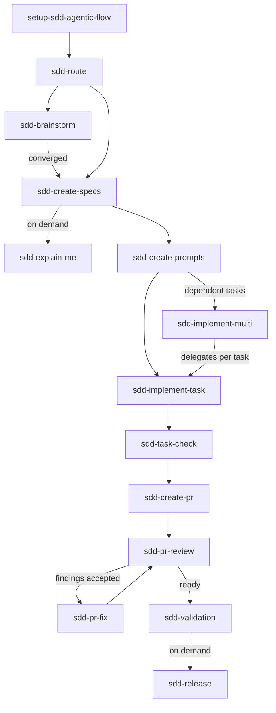

# sdd-agentic-flow

Versão prática em português. Leia o [README principal em inglês](README.md) para a referência completa.

`sdd-agentic-flow` é um toolkit local-first e zero-dependência de Spec-Driven Development (SDD) para
fluxos com agentes de código. Ele traz skills Markdown com contrato de capacidades, baselines
condensadas de TLC e TDD, dimensionamento adaptativo por perfil de feature e contexto de
projeto opcionalmente auto-descoberto. A instalação de skills é explícita e, por padrão,
user-local, sem nenhum arquivo no projeto; a configuração (`.sdd/config.yml`) fica no projeto
quando você a cria. A decisão final é sempre das pessoas. Veja a
[arquitetura](docs/architecture.md).

**Agnóstico de linguagem:** a CLI roda em Node.js; seu projeto não precisa. Java, PHP, C#,
Python, Go, Rust, Node.js: a CLI só instala skills em Markdown e configuração local e nunca
adiciona uma dependência ao seu projeto.

## Por que confiar?

O código é inspecionável. A CLI tem zero dependências runtime, não usa telemetria, postinstall ou rede externa por padrão. A única exceção é a flag opcional `doctor --check-updates`, que faz exatamente uma requisição ao registro do npm quando você a passa. A CLI não faz commit, push, merge, deploy ou publish automaticamente. Use `doctor` e `doctor --smoke` para validação local.

Por padrão, `install` usa o escopo `user`: escreve apenas nos diretórios globais de skills de cada agente suportado (Codex CLI, Cursor, Claude Code, VS Code + GitHub Copilot) e não cria nenhum arquivo no projeto. Use `--scope project` para instalar em `.agents/skills/` dentro do projeto. Veja [escopo de instalação](docs/installation-scope.md).

## Início rápido

Requer Node.js >= 22 para rodar a CLI (veja [compatibilidade de ambiente](docs/environment-compatibility.md)).
Esse requisito vale só para a CLI. **Seu projeto não precisa ser um projeto Node.js.** O
`sdd-agentic-flow` instala skills em Markdown e arquivos de configuração local; ele nunca
adiciona `package.json`, `node_modules` ou qualquer dependência ao seu projeto, seja ele Java,
PHP, C#, Python, Go, Rust, Node.js ou qualquer outra linguagem.

```bash
npx sdd-agentic-flow init
npx sdd-agentic-flow install core
npx sdd-agentic-flow doctor
```

Rodar `npx sdd-agentic-flow` sem nenhum comando mostra uma tela de status contextual (o que já
está configurado e uma sugestão de próximo comando) em vez da referência completa. Nada é
executado automaticamente. Em um terminal genuinamente interativo (um TTY real, sem a variável
de ambiente `CI` definida), um menu numerado também aparece abaixo da tela de status; escolher
uma opção roda exatamente o mesmo comando que a chamada explícita equivalente rodaria, e a opção
de desinstalar sempre é apenas uma prévia (`--plan`), nunca aplica de fato. Saída redirecionada,
scripts, CI e chamadas por agentes sempre veem só a tela de status, sem alteração. Use
`npx sdd-agentic-flow help` para a referência completa, ou `help <comando>` / `<comando> --help`
para o uso e exemplos de um comando específico.

Comandos de sucesso aceitam `--quiet` (`init`, `install`, `uninstall`, `discover`) para
suprimir a saída decorativa. Comandos, packs e nomes de agente desconhecidos recebem uma
sugestão "Did you mean `<mais próximo>`?". A saída colorida aparece automaticamente em um
terminal real; defina `NO_COLOR=1` para forçar texto simples, ou redirecione a saída, que
desativa cores automaticamente. Códigos de saída: `0` sucesso, `1` falha de validação tratada,
`2` erro interno inesperado.

Veja [instalação](docs/installation.md) para o guia completo de instalação.

Use `init --interactive` para escolher as opções iniciais, incluindo o perfil de feature
(`small_fix`, `medium_feature`, `large_feature`, `epic`). Packs disponíveis: `core`, `planning`, `execution`, `pr`, `multi-worktree`, `full`, `local-files` e `github`. O `init` também
auto-descobre `.sdd/context/project-context.md`; rode `discover [--force]` para atualizar, ou
`context status`/`context refresh` para ver a proveniência gravada (quando/de qual revisão foi
gerado) e atualizá-la sem precisar lembrar da flag.

Para escolher o perfil de idioma diretamente:

```bash
npx sdd-agentic-flow init --language en-US
npx sdd-agentic-flow init --language pt-BR
# --en / --br são atalhos para as duas flags acima
npx sdd-agentic-flow init --en
npx sdd-agentic-flow init --br
```

Veja os [perfis de idioma](docs/language-profiles.pt-BR.md) para conhecer o contrato.

## Comandos

```text
init [--interactive] [--language ...|--en|--br] [--feature-profile ...] [--execution-mode ...] [--autonomy-level ...] [--quiet]  Create local configuration
discover [--force] [--quiet]          Refresh auto-discovered project context
context [status|refresh|autonomy-state]  Show or refresh project context provenance, or autonomy loop state
install <pack> [--scope user|project] [--agent ...] [--plan] [--quiet]  Install a pack (default: user scope, zero project footprint)
doctor [--json] [--smoke] [--contracts] [--autonomy] [--verbose] [--check-updates]  Validate package or project setup
autonomous-resume [--force] [--override-guard=N --reason=...]  Resume an autonomous workflow paused at a guardrail
uninstall --plan                      Show only toolkit assets that would be removed
uninstall --apply [--include-config] [--full] [--scope user|project] [--agent ...] [--quiet]  Remove installed toolkit assets
list                                  List packs
help [command]                        Show the command reference, or one command's usage
```

`doctor --json` grava apenas JSON parseável. `doctor --smoke` valida init, install, preservação e
doctor em um diretório temporário isolado. `doctor --check-updates` faz uma única requisição ao
registro do npm para checar se há uma versão mais nova. Essa flag é a única exceção explícita e opcional ao
"sem acesso à rede por padrão"; veja [modelo de confiança](docs/trust-model.md).

`install` usa `--scope user` por padrão (escreve só nos diretórios
globais de skills por agente, ex. `~/.claude/skills`). Use `--scope project` para instalar em
`.agents/skills/` dentro do projeto. Use `--agent codex|cursor|claude-code|vscode-copilot` para
restringir quais diretórios globais são gravados. Veja
[escopo de instalação](docs/installation-scope.md). Se `doctor` reportar um `WARN`/`FAIL` que
você não entende, veja [solução de problemas](docs/troubleshooting.md). Todo comando também
aceita `--help` (equivalente a `help <comando>`) para seu uso completo e exemplos.

## Packs

| Pack | Finalidade |
| --- | --- |
| `core` | Setup seguro, especificação, implementação, checagem e validação. |
| `planning` | Specs e prompts de tarefa. |
| `execution` | Orientação para execução de uma ou múltiplas tarefas. |
| `pr` | Preparação de PR, revisão e correção de findings. |
| `multi-worktree` | Orientação para orquestração de múltiplas tarefas. |
| `full` | Todas as skills públicas. |

`local-files` e `github` são packs de composição para esses contextos de origem.

## Modos de execução

O toolkit documenta cinco modos locais: `plan`, `guided`, `apply`, `review` e `full`. `full` significa um fluxo local coordenado, não autonomia irrestrita. Veja [modos de execução](docs/execution-modes.md).

## Níveis de autonomia

`workflow.autonomy_level` (`manual`/`supervised`/`autonomous`, padrão `manual`) é um segundo eixo ortogonal: `execution_mode` define o que uma skill pode fazer; `autonomy_level` define se ela precisa de uma pessoa antes da próxima skill rodar. `autonomous` só avança quando os 7 guardrails determinísticos passam (conclusão, evidência, verificação, escopo, validade da transição, orçamento de recursos, sem override humano); qualquer falha devolve o controle a uma pessoa. Configure com `init --autonomy-level`, audite com `doctor --autonomy` e inspecione uma execução em andamento com `context autonomy-state` / `autonomous-resume`. Veja [níveis de autonomia](docs/autonomy-levels.md) e [guardrails de autonomia](docs/autonomy-guardrails.md).

## Desinstalação

```bash
npx sdd-agentic-flow uninstall --plan
npx sdd-agentic-flow uninstall --apply
```

A desinstalação preserva specs, relatórios, snapshots e código-fonte, e remove dos dois escopos por padrão. Use `--include-config` apenas para remover também `.sdd/config.yml`, ou `--scope`/`--agent` para restringir a remoção. Para um reset completo antes de uma reinstalação limpa, use `uninstall --apply --full`. Isso remove também `.sdd/context/project-context.md`, `.sdd/snapshots` e `.sdd/reports` (todos regeneráveis); `.specs/features` nunca é removido por nenhuma combinação de flags. Adicione `--quiet` para suprimir a linha explicativa final ("preserves ...").

## Fluxo principal

Plan → Prompt → Implement → Check → PR → Review → Fix → Validate



Use `sdd-route` quando o próximo passo não estiver claro. Ele apenas recomenda uma skill local e aponta para o `SKILL.md` selecionado; não invoca skills nem altera arquivos. Veja o [modelo de invocação](docs/invocation-model.md), [por que o toolkit existe](docs/why-this-exists.md)
e os [princípios de design](docs/design-principles.md).

## Skill map

Para a versão longa desta tabela, veja o
[catálogo de skills](docs/skills-catalog.md).

| Skill | Propósito | Entrada | Saída | Altera arquivos? | Modo padrão | Recomendado quando |
| --- | --- | --- | --- | --- | --- | --- |
| `setup-sdd-agentic-flow` | Configura o projeto | Contexto do projeto | Orientação de setup local | Sim, quando autorizado | guided | Iniciando um projeto |
| `sdd-route` | Recomenda a próxima skill local | Requisição/artefatos | Recomendação de rota | Não | plan | O próximo passo não está claro |
| `sdd-brainstorm` | Amadurece uma ideia vaga | Ideia inicial | Briefing pronto para spec | Sim, quando convergido | guided | A ideia ainda não está pronta para virar spec |
| `sdd-create-specs` | Planeja specs de feature | Source item OU código existente | Conjunto de feature specs | Sim, quando autorizado | plan | Requisitos precisam de estrutura, ou código sem docs precisa de specs |
| `sdd-explain-me` | Explica uma feature especificada | Pacote de specs | Explicação em linguagem simples | Sim, quando autorizado | guided | Alguém precisa de contexto sem ler todos os artefatos |
| `sdd-create-prompts` | Gera prompts de tarefa | Specs/tarefas | Prompts prontos para agente | Sim, quando autorizado | plan | O trabalho precisa ser delegado |
| `sdd-implement-task` | Implementa uma tarefa | Tarefa aprovada | Código e evidência | Sim, quando autorizado | apply | Uma tarefa delimitada está pronta |
| `sdd-implement-multi` | Planeja execução multi-tarefa | Conjunto de tarefas | Plano de execução | Sim, quando autorizado | guided | As tarefas têm dependências |
| `sdd-task-check` | Checagem independente de tarefa | Evidência da tarefa | Relatório de checagem | Não | review | Antes de aceitar uma tarefa |
| `sdd-create-pr` | Prepara PR | Mudança concluída | Pacote de PR | Sim, quando autorizado | guided | Um pacote de revisão é necessário |
| `sdd-pr-review` | Revisa PR | PR/conjunto de mudanças | Findings | Não | review | Revisando uma mudança |
| `sdd-pr-fix` | Corrige findings de PR | Findings | Mudança local corrigida | Sim, quando autorizado | apply | Os findings foram aceitos |
| `sdd-validation` | Valida uma feature | Evidência da feature | Relatório de validação | Não | review | Antes de concluir |
| `sdd-release` | Checa prontidão de release | Versão/changelog | Relatório de prontidão de release | Não | review | Antes de criar uma tag de release |

## TDD baseline

O `sdd-agentic-flow` usa o TLC baseline para planejamento e specs e o TDD
baseline para implementação. O TDD baseline usa testes focados em comportamento,
public seams acordados, ciclos RED → GREEN → REFACTOR e vertical slices. Veja
[TDD baseline](docs/tdd-baseline.md) e [integração TLC](docs/tlc-integration.md).

## Fluxos com agentes

Leia o [guia de uso das skills em português](docs/sdd-skills-usage-guide.pt-BR.md), e os guias para [Codex CLI](docs/using-with-codex.md), [Cursor](docs/using-with-cursor.md),
[Claude Code](docs/using-with-claude-code.md) e
[VS Code + GitHub Copilot](docs/using-with-vscode-copilot.md). Para um harness de desenvolvimento
opcional com IA, veja [harness recomendado](docs/recommended-harness.md).

As skills são Markdown-first e instaladas localmente. Veja
[compatibilidade com agentes](docs/agent-compatibility.md) para os fluxos validados e seus
limites.

## Vocabulário de domínio

Os perfis de idioma selecionam o idioma da saída voltada a pessoas; um glossário de domínio
registra os termos do produto. O glossário é opcional, nunca criado pelo `init`, e só pode ser
proposto ou escrito com autorização explícita. Veja
[vocabulário de domínio](docs/domain-vocabulary.md).

## Para quem é indicado?

Indicado para times que usam Spec-Driven Development, entregam features em sprints, usam TDD/test-first, precisam de rastreabilidade e delegam tarefas para agentes com revisão, e para trabalho multi-agente ou multi-worktree controlado.

## Não é otimizado para

Scripts descartáveis, agentes sem revisão humana, pipelines automáticos de release/deploy, ou fluxos que não querem specs, limites de tarefa, gates de revisão e checkpoints de validação.

## Exemplos, idioma e inspiração

O [exemplo genérico completo de task-management](examples/golden/task-management/) mostra um
source item até a validação. O README principal é em inglês; este documento é a introdução
prática em português. Veja [política de idioma](docs/i18n.md) para a política bilíngue completa.

### Golden flows

5 fluxos são comprovados como testes de integração em `test/cli.test.js`, não só documentação.
Cada um tem um `walkthrough.md` descrevendo os comandos que o teste roda e o resultado que ele
verifica: [greenfield](examples/golden/task-management/walkthrough.md),
[modo código existente](examples/golden/existing-code-mode/walkthrough.md),
[ciclo de vida do project-context](examples/golden/project-context-lifecycle/walkthrough.md),
[PR (create → review → fix → review)](examples/golden/pr-flow/walkthrough.md), e
[migração de versão (v0.8.0 → v0.9.0)](examples/golden/version-migration/walkthrough.md).

O toolkit adapta baselines de TLC e TDD e combina Spec-Driven Development, skills Markdown-first
e práticas locais de segurança. Veja [inspirações](docs/inspirations.md),
[NOTICE](NOTICE), [LICENSING.md](LICENSING.md), o
[compatibility promise](docs/compatibility-promise.md),
a [matriz de compatibilidade](docs/compatibility-matrix.md),
e o [guia de skills em português](docs/sdd-skills-usage-guide.pt-BR.md).

Para ajuda na decisão, veja os guias sobre
[escolhendo um perfil de feature](docs/guides/choosing-a-feature-profile.md),
[adotando em um repositório existente](docs/guides/adopting-in-a-brownfield-repo.md), e
[baselines condensadas vs. completas](docs/guides/condensed-vs-full-tlc-tdd.md).

## Limites de segurança

A CLI não chama APIs externas, não exige um tracker, não sincroniza remotamente, não se
autoatualiza e não realiza operações de Git/release. A flag opcional `doctor --check-updates`
verifica se há uma versão mais nova quando você a passa e nunca a instala por você. Isso não é uma garantia de compliance, segurança ou prontidão para
produção. Revise as saídas e as mudanças locais antes de aceitá-las. Veja [modelo de segurança](docs/safety-model.md).

## Publicação

Mantenedores: veja [publicação](docs/publishing.md).
