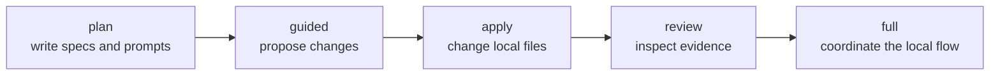
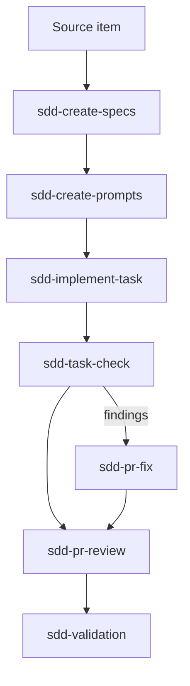
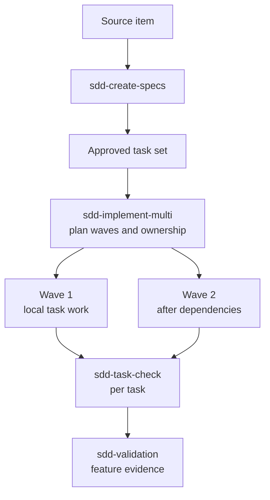

# SDD skills usage guide

This guide shows how to use the public `sdd-agentic-flow` skills in a local
coding-agent workflow. The toolkit keeps specifications, prompts, changes, and
validation evidence in the project so a person can inspect each step.

## 1. Install the toolkit

Run these commands from the project root:

```bash
npx sdd-agentic-flow init
npx sdd-agentic-flow install core
npx sdd-agentic-flow doctor
```

Use `init --interactive` when you want to choose project, agent, language,
source, flow, and safety settings. The CLI writes `.sdd/config.yml` and keeps
an existing configuration unchanged.

Use `npx sdd-agentic-flow list` to inspect available packs:

| Pack                     | Use it for                                                                |
| ------------------------ | ------------------------------------------------------------------------- |
| `core`                   | The standard specification, implementation, checking, and validation flow |
| `planning`               | Specs and task prompts                                                    |
| `execution`              | Single-task and multi-task execution                                      |
| `pr`                     | PR preparation, review, and finding repair                                |
| `multi-worktree`         | Planned parallel work                                                     |
| `full`                   | All public skills                                                         |
| `local-files` / `github` | Source-context additions                                                  |

## 2. Read the project configuration

`.sdd/config.yml` records the project name, branch, agent target, human output
language, source type, default flow, and safety gates. Read it before asking an
agent to use a skill. The agent should follow the file and stop when the
request conflicts with its configured gates.

## 3. Choose an execution mode



| Mode     | Allows                                                       | Does not allow by default                   |
| -------- | ------------------------------------------------------------ | ------------------------------------------- |
| `plan`   | Specs, designs, tasks, prompts, and reports                  | Source-code changes                         |
| `guided` | Proposed patches under human supervision                     | Automatic commit or push                    |
| `apply`  | Authorized local file changes                                | Commit, push, merge, deploy, or publish     |
| `review` | Findings and validation reports                              | File mutations                              |
| `full`   | A coordinated local planning, execution, and validation flow | Unrestricted autonomy or release operations |

`full` describes workflow coverage. It does not grant release authority.

## 4. Follow the single-task flow

Use this path when the work has one bounded task or a small serial task set.



Recommended prompts:

```text
Use the installed `sdd-create-specs` skill for this source item.
Follow `.sdd/config.yml`. Create or update the feature specification only.
Do not implement code or create commits. Stop if requirements are ambiguous.
Report evidence, open questions, and limitations.
```

```text
Use the installed `sdd-implement-task` skill for the approved task below.
Follow the task contract and `.sdd/config.yml`.
Change only the files required by this task. Run the required checks.
Do not commit, push, merge, deploy, or publish. Report evidence and limitations.
```

## 5. Use the multi-task flow when dependencies justify it

Choose this path when tasks have independent ownership or explicit execution
waves. `sdd-implement-multi` plans and coordinates local work; it does not turn
the workflow into an automatic release pipeline.



Use the single-task flow when dependencies are serial or the change is small.
Use the multi-task flow when parallel work has clear boundaries and the team
can review the resulting evidence.

## 6. Skill map

| Skill                    | Input             | Output            | Mutates files?  | Mode     |
| ------------------------ | ----------------- | ----------------- | --------------- | -------- |
| `setup-sdd-agentic-flow` | Project context   | Setup guidance    | When authorized | `guided` |
| `sdd-create-specs`       | Source item       | Feature specs     | When authorized | `plan`   |
| `sdd-create-prompts`     | Specs and tasks   | Agent prompts     | When authorized | `plan`   |
| `sdd-implement-task`     | Approved task     | Code and evidence | When authorized | `apply`  |
| `sdd-implement-multi`    | Task set          | Execution plan    | When authorized | `guided` |
| `sdd-task-check`         | Task and evidence | Check report      | No              | `review` |
| `sdd-create-pr`          | Completed change  | PR package        | When authorized | `guided` |
| `sdd-pr-review`          | Change set        | Review findings   | No              | `review` |
| `sdd-pr-fix`             | Accepted findings | Local fixes       | When authorized | `apply`  |
| `sdd-validation`         | Feature evidence  | Validation report | No              | `review` |

## 7. Agent-specific usage

The skills are Markdown files installed in `.agents/skills`. Point your agent
at the relevant skill and ask it to follow the project configuration.

### Codex CLI

```text
Use `.agents/skills/sdd-create-specs/SKILL.md` for this feature.
Follow `.sdd/config.yml`, work in `plan` mode, and leave the final decision to me.
```

### Claude Code

```text
Read the installed `sdd-validation` skill and validate this feature locally.
Use the evidence in the repository, do not call external services, and report
PASS, WARN, FAIL, evidence, and limitations.
```

### Cursor

```text
Use `.agents/skills/sdd-implement-task/SKILL.md` as the task contract.
Work in `apply` mode only after I authorize the local changes. Do not commit or push.
```

### Generic agent

```text
Use the installed Markdown skill that matches this step.
Read `.sdd/config.yml` first. Keep changes local, preserve unrelated files,
stop on ambiguity, and provide evidence before claiming completion.
```

Compatibility is documented and manually validated for Codex CLI, Claude Code,
and Cursor-style workflows. The Markdown-first design supports generic agents,
but it does not guarantee compatibility with every client.

## 8. Review and validate

Run local checks before accepting work:

```bash
npx sdd-agentic-flow doctor
npx sdd-agentic-flow doctor --json
npx sdd-agentic-flow doctor --smoke
```

The `task-check` skill reviews one task independently. The `validation` skill
reviews the accumulated feature. Neither replaces human review.

When a requirement, design decision, or implementation diverges from the SDD,
stop and reconcile the specification before continuing.

## 9. Undo local installation

Preview cleanup first:

```bash
npx sdd-agentic-flow uninstall --plan
npx sdd-agentic-flow uninstall --apply
npx sdd-agentic-flow uninstall --apply --include-config
npx sdd-agentic-flow uninstall --apply --full
```

Uninstall removes known toolkit skills. It preserves source code, specs,
reports, snapshots, and unknown paths. `--include-config` also removes
`.sdd/config.yml`. `--full` is a complete reset for a clean reinstall: it also
removes `.sdd/context/project-context.md`, `.sdd/snapshots`, and `.sdd/reports`
(never `.specs/features`). See [uninstall](uninstall.md).

## 10. Safety boundaries

The CLI runs locally and has zero runtime dependencies. It does not use
telemetry, postinstall actions, or outbound network access by default. Skills do
not automatically commit, push, merge, deploy, or publish. A human reviews the
diff and decides when work is complete.

For the detailed policy, read [the trust model](trust-model.md),
[execution modes](execution-modes.md), and [the safety model](safety-model.md).

For the Portuguese version, see [Guia de uso em português](sdd-skills-usage-guide.pt-BR.md).
