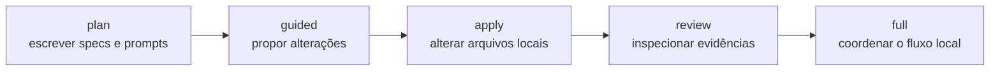
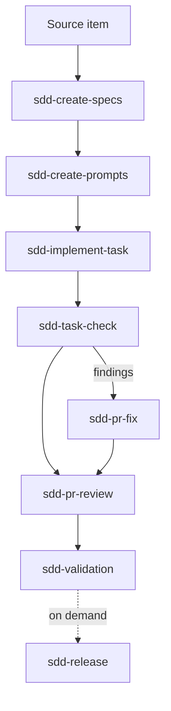
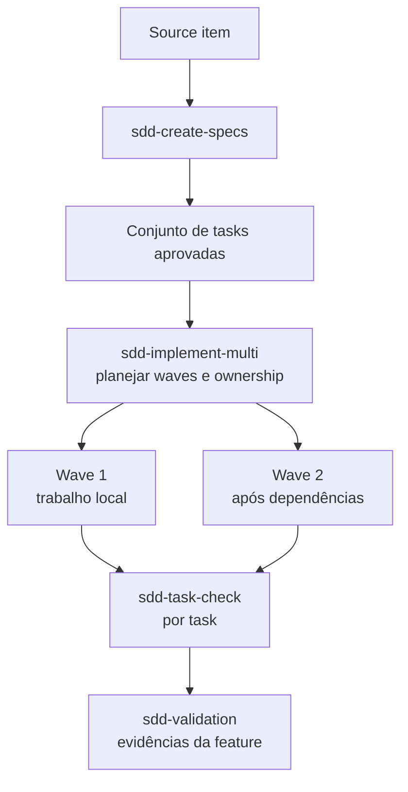

# Guia de uso das skills SDD

Use as skills públicas do `sdd-agentic-flow` em um fluxo local com agentes de código. O toolkit mantém especificações, prompts, alterações e evidências no projeto para que uma pessoa revise cada etapa.

## 1. Instale o toolkit

Execute no diretório raiz do projeto:

```bash
npx sdd-agentic-flow init
npx sdd-agentic-flow install core
npx sdd-agentic-flow doctor
```

Use `init --interactive` para escolher projeto, agente, idioma, origem, fluxo e
configurações de segurança. A CLI grava `.sdd/config.yml` e preserva uma
configuração existente.

Use `npx sdd-agentic-flow list` para consultar os packs:

| Pack                     | Uso                                                              |
| ------------------------ | ---------------------------------------------------------------- |
| `core`                   | Fluxo padrão de especificação, implementação, checks e validação |
| `planning`               | Specs e prompts de tarefas                                       |
| `execution`              | Execução de uma ou várias tarefas                                |
| `pr`                     | Preparação, review e correção de findings de PR                  |
| `multi-worktree`         | Trabalho paralelo planejado                                      |
| `full`                   | Todas as skills públicas                                         |
| `local-files` / `github` | Complementos para contextos de origem                            |

## 2. Leia a configuração do projeto

`.sdd/config.yml` registra nome do projeto, branch, agente, idioma de saída,
tipo de origem, fluxo padrão e gates de segurança. Leia o arquivo antes de
pedir que um agente use uma skill. O agente deve seguir a configuração e parar
quando o pedido contrariar seus gates.

## 3. Escolha um modo de execução



| Modo     | Permite                                                      | Não permite por padrão                       |
| -------- | ------------------------------------------------------------ | -------------------------------------------- |
| `plan`   | Specs, designs, tasks, prompts e reports                     | Alterações no código-fonte                   |
| `guided` | Patches propostos sob supervisão humana                      | Commit ou push automático                    |
| `apply`  | Alterações locais autorizadas                                | Commit, push, merge, deploy ou publish       |
| `review` | Findings e reports de validação                              | Mutações de arquivos                         |
| `full`   | Fluxo local coordenado de planejamento, execução e validação | Autonomia irrestrita ou operações de release |

`full` descreve a cobertura do fluxo. Não concede autoridade para publicar.

## 4. Siga o fluxo de uma tarefa

Use este caminho para uma tarefa delimitada ou poucas tarefas seriais.



Prompts recomendados:

```text
Use a skill instalada `sdd-create-specs` para este source item.
Siga `.sdd/config.yml`, trabalhe em modo `plan` e crie ou atualize apenas a
especificação. Não implemente código nem crie commits. Pare se houver
ambiguidade. Relate evidências, perguntas abertas e limitações.
```

```text
Use a skill instalada `sdd-implement-task` para a task aprovada abaixo.
Siga o contrato da task e `.sdd/config.yml`. Altere somente os arquivos
necessários. Execute os checks exigidos. Não faça commit, push, merge, deploy ou
publish. Relate evidências e limitações.
```

Depois que `sdd-validation` passar, use `sdd-release` sob demanda quando precisar checar prontidão de release antes de criar uma tag. Veja [prompt-recipes](prompt-recipes.md#check-release-readiness) (em inglês).

## 5. Use o fluxo de várias tarefas quando houver dependências

Escolha este caminho quando as tarefas tiverem ownership independente ou waves
de execução explícitas. `sdd-implement-multi` planeja e coordena o trabalho
local; não transforma o fluxo em um pipeline automático de release.



Prefira o fluxo de uma tarefa quando as dependências forem seriais ou a
alteração for pequena. Use várias tarefas quando o trabalho paralelo tiver
limites claros e a equipe puder revisar as evidências.

## 6. Mapa de skills

| Skill | Entrada | Saída | Altera arquivos? | Modo |
| --- | --- | --- | --- | --- |
| `setup-sdd-agentic-flow` | Contexto do projeto    | Orientação de setup  | Quando autorizada | `guided` |
| `sdd-create-specs`       | Source item            | Specs da feature     | Quando autorizada | `plan`   |
| `sdd-create-prompts`     | Specs e tasks          | Prompts para agentes | Quando autorizada | `plan`   |
| `sdd-implement-task`     | Task aprovada          | Código e evidências  | Quando autorizada | `apply`  |
| `sdd-implement-multi`    | Conjunto de tasks      | Plano de execução    | Quando autorizada | `guided` |
| `sdd-task-check`         | Task e evidências      | Report de check      | Não               | `review` |
| `sdd-create-pr`          | Alteração concluída    | Pacote de PR         | Quando autorizada | `guided` |
| `sdd-pr-review`          | Conjunto de alterações | Findings de review   | Não               | `review` |
| `sdd-pr-fix`             | Findings aceitos       | Correções locais     | Quando autorizada | `apply`  |
| `sdd-validation`         | Evidências da feature  | Report de validação  | Não               | `review` |
| `sdd-release`            | Versão/changelog       | Report de prontidão de release | Não     | `review` |

## 7. Uso com agentes

As skills são arquivos Markdown instalados em `.agents/skills`. Aponte o agente
para a skill correspondente e peça que siga a configuração do projeto.

### Codex CLI

```text
Use `.agents/skills/sdd-create-specs/SKILL.md` para esta feature.
Siga `.sdd/config.yml`, trabalhe em modo `plan` e deixe a decisão final comigo.
```

### Claude Code

```text
Leia a skill instalada `sdd-validation` e valide esta feature localmente.
Use as evidências do repositório, não chame serviços externos e relate PASS,
WARN, FAIL, evidências e limitações.
```

### Cursor

```text
Use `.agents/skills/sdd-implement-task/SKILL.md` como contrato desta task.
Trabalhe em modo `apply` somente após minha autorização para alterações locais.
Não faça commit nem push.
```

### Agente genérico

```text
Use a skill Markdown instalada que corresponde a esta etapa.
Leia `.sdd/config.yml` primeiro. Mantenha as alterações locais, preserve
arquivos não relacionados, pare diante de ambiguidades e apresente evidências
antes de declarar conclusão.
```

O projeto foi validado manualmente com Codex CLI, Claude Code e fluxos no estilo
Cursor. O formato Markdown-first atende agentes genéricos, mas não garante
compatibilidade com todo cliente.

## 8. Faça review e validação

Execute os checks locais antes de aceitar o trabalho:

```bash
npx sdd-agentic-flow doctor
npx sdd-agentic-flow doctor --json
npx sdd-agentic-flow doctor --smoke
```

A skill `task-check` revisa uma task de forma independente. A skill
`validation` revisa a feature acumulada. Nenhuma substitui a revisão humana.

Quando um requisito, decisão de design ou implementação divergir da SDD, pare
e reconcilie a especificação antes de continuar.

## 9. Desfaça a instalação local

Veja o plano de limpeza antes de aplicar:

```bash
npx sdd-agentic-flow uninstall --plan
npx sdd-agentic-flow uninstall --apply
npx sdd-agentic-flow uninstall --apply --include-config
npx sdd-agentic-flow uninstall --apply --full
```

A desinstalação remove as skills conhecidas do toolkit. Ela preserva código,
specs, reports, snapshots e caminhos desconhecidos. `--include-config` também
remove `.sdd/config.yml`. `--full` é um reset completo para reinstalação
limpa: remove também `.sdd/context/project-context.md`, `.sdd/snapshots` e
`.sdd/reports` (nunca `.specs/features`). Veja [uninstall](uninstall.md).

## 10. Limites de segurança

A CLI roda localmente e não possui dependências runtime. Ela não usa telemetria,
postinstall ou rede externa por padrão. As skills não fazem commit, push, merge,
deploy ou publish automaticamente. Uma pessoa revisa o diff e decide quando o
trabalho está concluído.

Leia o [trust model](trust-model.md), os [execution modes](execution-modes.md)
e o [safety model](safety-model.md) para conhecer a política completa.

Para a versão em inglês, veja o [guia de uso em inglês](sdd-skills-usage-guide.md).
